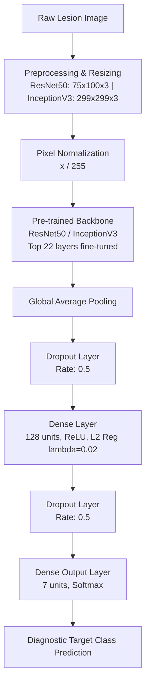

# Early Detection of Skin Cancer Through Human-Computer Collaboration

This repository contains the implementation and web deployment pipeline for early skin cancer classification published in ***Artificial Intelligence in Medicine*** (CRC Press, 2024). The project utilizes a **ResNet-50** deep transfer learning architecture integrated with a **Flask** web application to facilitate human-computer collaboration in dermatological analysis.

---

## Authors

* **Piyush Kumar**
* **Rishi Chauhan**
* **Achyut Shankar**
* **Thompson Stephan**

---

## Abstract

Skin cancer is a perilous disease due to which a lot of people suffer every year. The disease transpires on the skin of people and spreads all over the skin rapidly. Skin cancer is broadly classified into three distinct categories. These are basal cell cancer (BCC), squamous cell cancer (SCC), and melanoma. Melanoma is the most fatal of all the skin cancer types. It is difficult to detect melanoma from the naked eye.

Most people get affected by skin cancer due to being exposed to ultraviolet radiation. People who have lighter skin are more prone to suffer from this disease.

---

## Overview

Skin cancer is characterized by rapid, abnormal skin cell growth, primarily categorized into basal cell carcinoma (BCC), squamous cell carcinoma (SCC), and melanoma. Melanoma is the most aggressive form and presents significant diagnostic challenges when relying strictly on visual inspection. 

Prolonged exposure to ultraviolet (UV) radiation remains a major risk factor, particularly affecting fair-skinned populations across high-incidence regions such as Australia and New Zealand. To address these diagnostic challenges, this project establishes a human-computer collaborative pipeline—leveraging deep transfer learning (ResNet-50) paired with an interactive Flask web application—to aid clinicians in early dermatological screening.

---

## Key Features

* **ResNet-50 Architecture**: Fine-tuned deep convolutional network for automated dermatological feature extraction, achieving **93.47% validation accuracy**.
* **7-Class Classification**: Multi-class diagnostic model targeting common pigmented skin lesions from the HAM10000 dataset.
* **Flask Web Application**: Real-time deployment framework enabling users to upload image samples and view diagnostic outputs.

---

## Dataset

The model is trained on the **Skin Cancer MNIST: HAM10000** dataset, a large-scale collection of multi-source dermatoscopic images of pigmented lesions.

* **Dataset Name**: Skin Cancer MNIST: HAM10000
* **License**: CC BY-NC-SA 4.0
* **Original Challenge**: [ISIC 2018 Challenge](https://challenge2018.isic-archive.com)
* **Data Source**: [Harvard Dataverse (doi:10.7910/DVN/DBW86T)](https://dataverse.harvard.edu/dataset.xhtml?persistentId=doi:10.7910/DVN/DBW86T)

### Diagnostic Classes
1. **Actinic Keratoses / Intraepithelial Carcinoma (akiec)**
2. **Basal Cell Carcinoma (bcc)**
3. **Benign Keratosis-like Lesions (bkl)**
4. **Dermatofibroma (df)**
5. **Melanoma (mel)**
6. **Melanocytic Nevi (nv)**
7. **Vascular Lesions (vasc)**

---

## Architecture Overview & Flowchart

The model leverages transfer learning on ImageNet-pretrained convolutional backbones. early layers are frozen to retain low-level feature extraction capabilities, while the top 22 layers are unfreezed and fine-tuned for dermatological feature adaptation.



## Repository Structure

```text
.
├── Flask_Framework.ipynb      # Web application deployment & API framework logic
├── Major project 2021.ipynb   # End-to-end training, evaluation & performance metrics notebook
├── MP.ipynb                   # Model prototyping & experimentation script
└── content/                   # Web interface HTML templates
    ├── index.html             # Landing page template
    ├── predict.html           # Image upload and classification interface
    └── works.html             # System workflow and architectural details
```
## Technical Specifications

| **Feature** | **Details** | 
| --- | --- |
| Details | ResNet50, InceptionV3 (ImageNet pre-trained) |
| Input Resolutions | $75 \times 100 \times 3$ (ResNet50), $299 \times 299 \times 3$ (InceptionV3) |
| Classification Head | GAP $\rightarrow$ Dropout ($0.5$) $\rightarrow$ Dense ($128$ units, ReLU, L2 $\lambda = 0.02$) $\rightarrow$ Dropout ($0.5$) $\rightarrow$ Softmax ($7$ units) |
| Target Classes | akiec (Actinic Keratoses), bcc (Basal Cell Carcinoma), bkl (Benign Keratosis), df (Dermatofibroma), mel (Melanoma), nv (Melanocytic Nevi), vasc (Vascular Lesions) |

## Dependencies
- **Core Runtime:** Python 3.7+
- **Deep Learning Frameworks:** TensorFlow / TensorFlow-GPU v2.4.1, Keras v2.4.3
- **Data Processing & I/O:** NumPy v1.19.5, SciPy v1.6.2, h5py v2.10.0, Pillow v8.2.0
- **Visualization:** Matplotlib v3.4.1, Cycler, Kiwisolver

## Installation and Setup

1. **Repository Setup**
[git clone](https://github.com/your-username/skin-lesion-classification.git)

`cd skin-lesion-classification`

2. **Environment Configuration**

`pip install tensorflow-gpu==2.4.1 keras==2.4.3 numpy==1.19.5 scipy==1.6.2 h5py==2.10.0 pillow==8.2.0 matplotlib==3.4.1`

3. **Data Preparation**

Organize the dataset into subdirectories categorized by target labels:

```text
data/
├── train_dir/
│   ├── akiec/
│   ├── bcc/
│   └── ...
└── val_dir/
    ├── akiec/
    ├── bcc/
    └── ...
```
4. **Model Training & Evaluation**

`python train.py --backbone resnet50 --epochs 50 --batch_size 32`

5. **Inference Pipeline**

`python predict.py --image_path path/to/sample.jpg --weights saved_models/resnet50_weights.h5`

## Experimental Results

- Parameter Breakdown (ResNet50 Backbone):
  - Total Parameters: 23,850,887
  - Trainable Parameters: 9,194,503
  - Non-Trainable / Frozen Parameters: 14,656,384
- Sample Validation Performance:
  - Sample Evaluation (ISIC_0024475.jpg): Logit output vector [[-2.58, -1.32, -1.52, -2.44, -2.23, -0.39, -1.83]]
  - Class Verdict: Predicted index 5 (vasc - Vascular Lesion)
 

## Citation

If you use this codebase or model architecture in your research, please cite our publication:

```
@article{kumar2024early,
  title={Early detection of skin cancer through human-computer collaboration},
  author={Kumar, Piyush and Chauhan, Rishi and Shankar, Achyut and Stephan, Thompson},
  journal={Artificial Intelligence in Medicine},
  volume={324},
  pages={71},
  year={2024},
  publisher={CRC Press}
}
```
